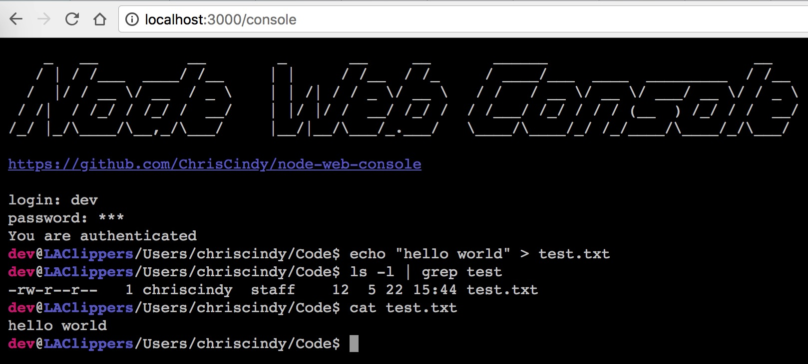

[English](./README.md) | 简体中文
```
    _   __          __        _       __     __       ______                       __   
   / | / /___  ____/ /__     | |     / /__  / /_     / ____/___  ____  _________  / /__ 
  /  |/ / __ \/ __  / _ \    | | /| / / _ \/ __ \   / /   / __ \/ __ \/ ___/ __ \/ / _ \
 / /|  / /_/ / /_/ /  __/    | |/ |/ /  __/ /_/ /  / /___/ /_/ / / / (__  ) /_/ / /  __/
/_/ |_/\____/\__,_/\___/     |__/|__/\___/_.___/   \____/\____/_/ /_/____/\____/_/\___/ 
                                                                                        
```
## 概要

Node-Web-Console 是基于 Node.js 开发的一个网页版应用（可以理解为网页版的 SSH）。它允许你直接从浏览器向服务器发送并执行 shell 命令。这个项目受到另一个 php 项目 [web-console](https://github.com/nickola/web-console) 的启发并基于其移植而来。Node-Web-Console 非常轻量，其不需要依赖数据库，同时能够在 3 分钟内配置完毕。



## 特性

- 界面整洁友好，看起来就像是真的 shell 终端
- 易于扩展。Node-Web-Console 使用 [Koa](https://github.com/koajs/koa) 作为 web 服务器，你可以很容易地扩展或者将其集成到你自己的项目中
- 安全。你可以在你的服务器上配置 HTTPS(SSL)，然后 Node-Web-Console 的所有流量都将受到保护。同时，Node-Web-Console 设置了标记，不允许搜索引擎索引其所有页面
- 极速配置。Node-Web-Console 是一个纯 Node.js 项目，其可被极快地安装和配置使用
- 移动端友好。Node-Web-Console 支持移动浏览器上的软键盘输入。因此你可以在你的移动设备上方便地使用它

## 安装

Node-Web-Console 使用 [Koa](https://github.com/koajs/koa) 作为 web 服务器，因此 node 版本需要至少 7.6.0 或者更高。

```shell
git clone https://github.com/ChrisCindy/node-web-console.git
cd node-web-console

# 安装依赖
npm install
```

## 上手

- 配置选项
  
  打开 `config/index.js` 并输入你的 `$USER` 和 `$PASSWORD` 凭证，同时你可以编辑其他任何设置（注释中有设置的描述）。

- 启动 web 服务器

  - Development mode

  ```shell
  ## 构建并且监听前端脚本及样式表
  npm run client:dev

  ## 打开另一个 shell
  ## 启动 web 服务器
  npm run server:dev
  ```

  - Production mode

  ```shell
  ## 构建并且压缩前端脚本和样式表
  npm run client:build

  ## 使用 pm2 启动 web 服务器
  npm run prod
  ```

- 在浏览器打开 `http://localhost:3000/console`，开始使用吧。


## 证书

Node-Web-Console 使用 [GNU LGPL Version 3](http://www.gnu.org/licenses/lgpl.html) 证书。
